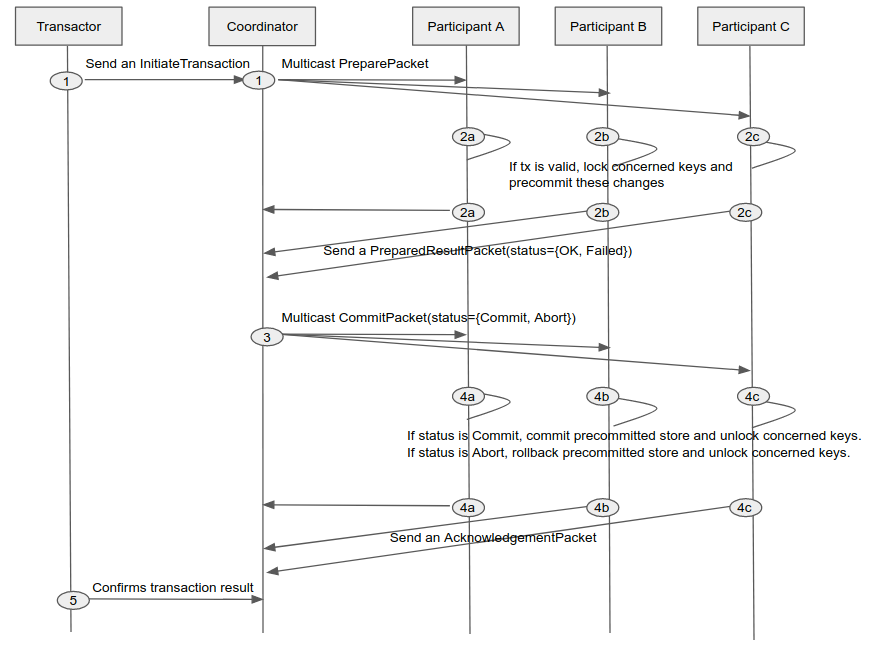

# Cross

Cross is a framework for Cross-chain transaction. It is implemented as [Cosmos module](https://github.com/cosmos/cosmos-sdk).

Cross provides several key features:

- Cross-chain transaction support - Supports a transaction that atomically executes each contract functions on multiple blockchain networks(zones).
- Smart contract support - Provides a contract system that can support general smart contracts. Such contracts gain Cross-chain transaction support. Contract developers are not forced to implement Atomic commit and locking protocol at each contract develop.
- Compliant with [ics-004](https://github.com/cosmos/ics/tree/master/spec/ics-004-channel-and-packet-semantics) - Supports above features on networks where membership changes dynamically

**This project is currently under development and not production ready.**

## Motivation

It is difficult to atomically execute general smart contract on multiple networks like Train-Hotel problem. If we can convert Train and Hotel reservation rights into NFT that can be moved to any chain using Two-way peg method such as [ics-020](https://github.com/cosmos/ics/tree/master/spec/ics-020-fungible-token-transfer), it may be possible to solve this problem simply by doing atomicswap on a single chain. However, if each Token's metadata (e.g. a whitelist of owner) depends on other states of its origin chain and common state is referenced by other contract states, it is difficult to move between chains.

To solve such a problem, we need to be able to execute BOTH or NEITHER reservation contracts that exist in two different chains, rather than pegging to single blockchain. This is similar to Atomic commit protocol for distributed systems. To achieve this, each contract state machine must be able to support "Lock" state. But it is not safe to enforce these requirements on contract developers. So we decided to create a framework that supports Atomic commit protocol and contract system that transparently satisfy required locking protocol.

## Protocol description

To achieve Cross-chain transaction, it is necessary to execute ALL or Nothing transaction on multiple networks. This is called Atomic commit in a distributed system. A common protocol for achieving this is Two phase commit (2PC).

We defined requirements to achieve Cross-chain transaction between networks connected by [ics-004](https://github.com/cosmos/ics/tree/master/spec/ics-004-channel-and-packet-semantics) with classic 2PC. There are some prior art such as ["Dang et al.(2018) Towards Scaling Blockchain Systems via Sharding"](https://arxiv.org/abs/1804.00399). It is assumed that bellow properties are required to achieve 2PC on Cross-chain as with the research of Dang et al.

1. Safety for general blockchain transactions
2. Liveness against malicious coordinators

We use Two-phase locking protocol to achieve 1. Therefore, Contract state machine must have Lock and Unlock state.

It is known that 2PC can be a blocking protocol when Coordinator fails. Therefore, in order to achieve 2, we use a blockchain network that executes BFT consensus as a coordinator.

To achieve Cross-chain transaction, we implemented above requirements. 2PC execution flow of Cross-chain transaction is shown below. Note that the number of participants is 3(A,B,C) and Coordinator is not included in Participants.

## Maintainers

- [Jun Kimura](https://github.com/bluele)
