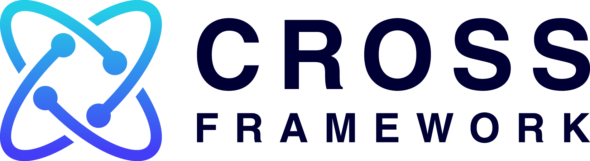

# Cross Framework

  

  
  

Cross is a framework for Cross-chain transaction. It is implemented as [Cosmos module](https://github.com/cosmos/cosmos-sdk).

Cross provides several key features:

- **Cross-chain transaction support** - Supports the transaction that can support an atomic execution on different blockchains. We call such a transaction "Cross-chain transaction".
- **General application support** - Provides a framework to enable the support of "general" application as smart contract. ("general" application refers to models like smart contract on Ethereum, not UTXO model.) With Cross framework, smart contract developers are not forced to implement Atomic commit and locking protocol at each contract develop.
- **Compliant with [ics-004](https://github.com/cosmos/ics/tree/master/spec/ics-004-channel-and-packet-semantics)** - Supports above features on networks where membership changes dynamically

## Motivation

It is difficult to atomically execute general smart contract on multiple networks. One such example is [Train-And-Hotel problem](https://github.com/ethereum/wiki/wiki/Sharding-FAQ#what-is-the-train-and-hotel-problem). If we can convert Train and Hotel reservation rights into NFT that can be moved to any chain using Two-way peg method such as [ics-020](https://github.com/cosmos/ics/tree/master/spec/ics-020-fungible-token-transfer), it may be possible to solve this problem simply by doing atomicswap on a single chain. However, if each Token's metadata (e.g. a whitelist of owner) depends on other states of its origin chain and common state is referenced by other contract states, it is difficult to move between chains.

To solve such problem, we need to be able to execute All or Nothing reservation contracts that exist in two different chains, rather than pegging to single blockchain. This is similar to Atomic commit protocol for distributed systems. To achieve this, each contract's state machine needs to lock the state required for "commit" at "prepare" phase. But it is not safe to enforce these requirements on each contract developers. Therefore, we decided to implement Atomic commit protocol in compliance with ics-004 and create a datastore that transparently meets the required locking protocol.

## Getting started

Please see [here](./docs/spec/02_smart_contract.md#how-to-execute-a-smart-contract-on-cross-chain).

## Documents

For specs and documents, see [here](./docs/spec).

Japanese documents can be found [here](https://github.com/datachainlab/public-docs/blob/master/cross/concepts_ja.md).

## FAQ

Please see [here](./docs/spec/XX_faq.md).

## Maintainers

- [Jun Kimura](https://github.com/bluele)
