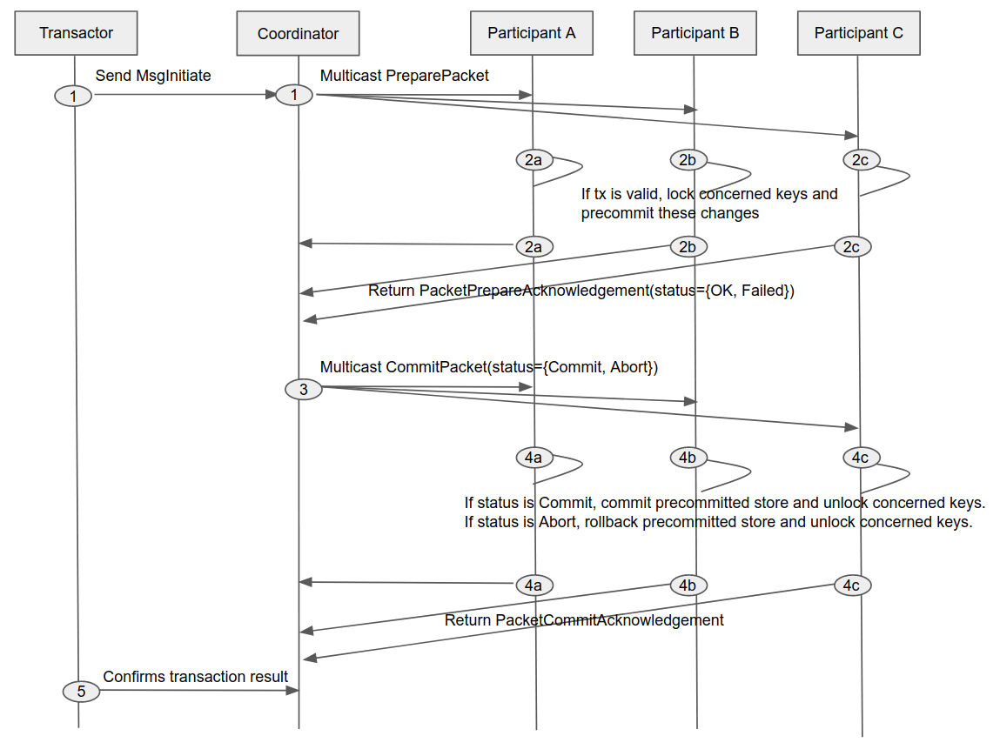
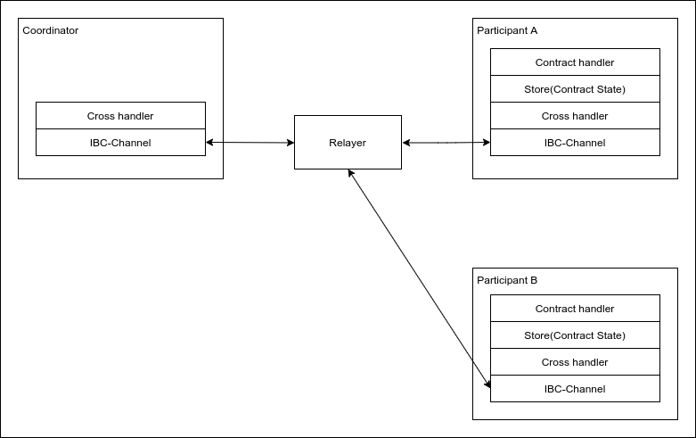

# Basic

## What's Cross?

Cross is a framework that provides the development of smart contracts that can support an atomic execution on different blockchains.

## Protocol description

To achieve Cross-chain transaction, it is necessary to execute ALL or Nothing transaction on multiple networks. This is called Atomic commit in a distributed system. A common protocol for achieving this is Two phase commit (2PC).

We defined requirements to achieve Cross-chain transaction between networks connected by [ics-004](https://github.com/cosmos/ics/tree/master/spec/ics-004-channel-and-packet-semantics) with classic 2PC. There are some prior art such as ["Dang et al.(2018) Towards Scaling Blockchain Systems via Sharding"](https://arxiv.org/abs/1804.00399). It is assumed that bellow properties are required to achieve 2PC on Cross-chain as with the research of Dang et al.

1. Safety for general blockchain transactions
2. Liveness against malicious coordinators

We use Two-phase locking protocol to achieve 1. Therefore, Contract state machine must have "Lock" and "Unlock" state.

It is known that 2PC can be a blocking protocol when Coordinator fails. Therefore, in order to achieve 2, we use a blockchain network that executes BFT consensus as a coordinator.

To achieve Cross-chain transaction, we implemented above requirements. 2PC execution flow of Cross-chain transaction is shown below. Note that the number of participants is 3(A,B,C) and Coordinator is not included in Participants.

## Architecture

In this section, we describe the structure of Cross and each layer.

Each layer is described below.

- IBC-Channel
    
    This is the Channel spec as defined in the ICS. By complying with this, we can use IBC ecosystem.

- Cross handler

    Cross-Handler has multiple roles: first, it handles the MsgInitiate to initiate the Cross-chain transaction from User; second, it handles the sending and receiving of packets between the coordinator and the participant in order to execute the atomic commit. These requests will be sent by  Relayer. The details of these implementations can be found [here](https://github.com/datachainlab/cross/blob/master/x/ibc/cross/handler.go).

- Store
    
    Store is a datastore that stores the state of each of smart contracts.
    It also implements the locking protocol required by "Prepare" step of the Atomic commit protocol (2PC). This will get the Lock corresponding to the State's Read and Write operations. The details of these implementations can be found [here](https://github.com/datachainlab/cross/tree/master/x/ibc/store/lock).

- Contract handler

    For smart contract developers, this layer is probably the most important. It is the layer that provides smart contract that executes the application logic and stores the state in Store. Contract-Handler provides a Smart Contract that is called by Cross-chain transaction. The details of these implementations can be found [here](https://github.com/datachainlab/cross/tree/master/x/ibc/contract).

Now let's take a look at [the details of how Smart contract works](./02_smart_contract.md)!
